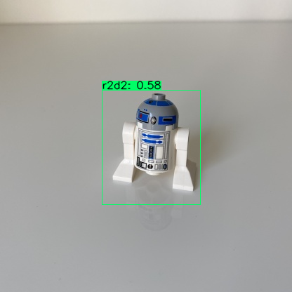
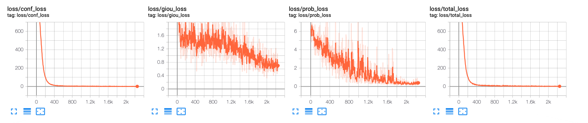

# iX Tutorial zur Objekterkennung in Python3 mit Tensorflow 2 und YOLOv3



Dieses Repository enthält Quellcode für das dreiteilige iX Tutorial ```Ein eigenes Deep Learning Modell für NVIDIAs Jetson Familie erstellen```. Es basiert in Teilen auf Beispielen von Yun Yan (https://github.com/YunYang1994/TensorFlow2.0-Examples/tree/master/4-Object_Detection/YOLOV3). Für diese Artikelserie wurde der Quellcode ein eingen Stellen überarbeitet und weiterentwickelt um in Kombination mit Google Colab Notebooks zusammenarbeiten zu können. Neben diesem Quellcode-Repository
existiert ein Daten-Repository das zwingend für die Nutzung benötigt wird. Beide Repositories sollten zusammen genutzt werden.

## Installation in Google Colab

Um mit dem Tutorial innerhalb von Google Colab optimal arbeiten zu können, sollte es wie folgt installiert werden:

<pre>
%cd /content/
!git clone https://github.com/rawar/ix-tut-yolov3.git
</pre>

Das Daten-Repository kann dann mit

<pre>
%cd /content/ix-tut-yolov3
!git clone https://github.com/rawar/ix-tut-yolov3-data.git
</pre>

innerhalb des Quellcode-Repositories installiert werden.

## Wo liegt was?

Im Repository ```ix-tut-yolov3``` gibt es vier Verzeichnisse:

1. core - beinhaltet alle für das YOLOv3 Modell für Keras nötigen Dateien
2. notebooks - die Google Colab Notebooks des Tutorials 
3. docs - enthält ein paar Abbildungen für dieses README
4. tests - enthält ein paar Test-Bilder 

Im Hauptverzeichnis liegen die nötigen Python3-Skripte für das Modelltraining und Modelltesting.

## Modell-Training

Für das Modell-Training sollte folgendes Log-Verzeichnis unterhalb von ```ix-tut-yolov3-data``` angelegt werden mit

<pre>
!mkdir /content/ix-tut-yolov3/ix-tut-yolov3-data/logs
</pre>

Mit Hilfe des Trainings-Skripts 

<pre>
!python3 train.py
</pre>

lässt sich das Training starten. Aktuell wird das Model ```starwars_yolov3``` über 50 Epochen trainiert, was 11950 Trainingsschritten entspricht. 

### Tensorboard

Der Fortschritt beim Modelltraining lässt sich auch in Google Colab mit Hilfe von Tensorboard verfolgen. Dazu lässt sich die Tensorboard-Erweiterung mit

<pre>
try:
  %tensorflow_version 2.x
except Exception:
  pass

%load_ext tensorboard
</pre>

laden und mit Hilfe des Magic-Kommandos

<pre>
%tensorboard --logdir /content/ix-tut-yolov3/ix-tut-yolov3-data/logs/
<&pre>

laden und anzeigen. 



## Modell Test

Ein trainiertes Modell kann mit Hilfe von ```image_demo.py``` getestet werden. Im Verzeichnis ```tests``` finden sich ein paar Testbilder.


